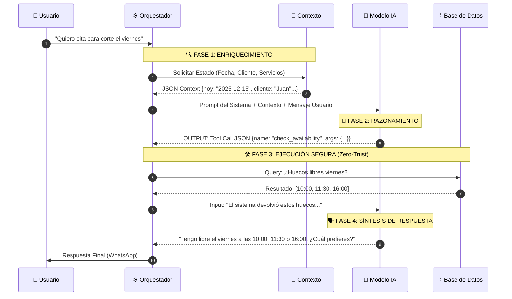

# 🧠 Flujo de Trabajo de Inteligencia Artificial (AI Workflow)

AgendIA implementa una arquitectura de **Agentes Cognitivos**. A diferencia de los chatbots tradicionales basados en árboles de decisión estáticos, nuestro sistema utiliza Modelos de Lenguaje (LLMs) equipados con "Herramientas" (Tools) para razonar, planificar y ejecutar acciones sobre la base de datos en tiempo real.

Este documento detalla el ciclo de vida de una interacción y cómo garantizamos la fiabilidad de las respuestas.

## 🔄 El Ciclo Cognitivo (The Cognitive Loop)

Cada mensaje entrante de un usuario dispara un proceso de orquestación secuencial. El siguiente diagrama detalla la interacción entre los componentes:



## 🛠️ Herramientas Definidas (Function Calling)

La IA no tiene permiso para inventar información. Solo puede interactuar con el mundo real a través de un set estricto de funciones predefinidas que el backend expone.

### 1. Consultas (Read-Only)

- **`check_availability(date, service_id, staff_name)`**:
  - Calcula matemáticamente los huecos libres basándose en la duración del servicio y los horarios del personal.
  - _Mecanismo de seguridad:_ Si el día solicitado está lleno, el sistema busca automáticamente disponibilidad en los 7 días siguientes para ofrecer alternativas proactivas.
- **`get_services()`**:
  - Recupera la lista actualizada de servicios y precios desde la base de datos.
- **`get_my_appointments()`**:
  - Permite al usuario consultar sus citas futuras confirmadas.

### 2. Transacciones (Write Operations)

- **`book_appointment(service_id, date, time)`**:
  - Intenta reservar un hueco específico.
  - _Validación:_ El backend verifica **atómicamente** que el hueco siga libre antes de confirmar.
- **`cancel_appointment()`**:
  - Localiza la próxima cita futura del usuario y la cancela.
- **`reschedule_appointment(date, time)`**:
  - Flujo complejo que implica cancelar la cita anterior y reservar la nueva en una sola transacción.
- **`update_customer_name(name)`**:
  - Registra el nombre del cliente si es la primera vez que contacta ("Cold Start").

## 💉 Inyección de Contexto Dinámico

Para que el LLM se comporte como un empleado real, en cada interacción inyectamos un "Prompt de Sistema" dinámico que contiene:

1.  **Consciencia Temporal:** La IA sabe exactamente qué día y hora es hoy ("Hoy es Lunes 15 de Diciembre"). Entiende conceptos relativos como "mañana", "el próximo finde" o "pasado mañana".
2.  **Identidad de Marca:** Se inyecta el tono configurado por el negocio (Formal, Amigable o Divertido) y el nombre del bot.
3.  **Estado del Cliente:** Si el sistema detecta que es un cliente nuevo (sin nombre en DB), la instrucción prioritaria del prompt cambia a _"Tu objetivo principal es obtener el nombre del usuario antes de reservar nada"_.

## 🛡️ Protocolos de Seguridad y Anti-Alucinación

Los LLMs pueden cometer errores. AgendIA implementa capas de defensa para mitigarlos:

- **Validación de IDs:** La IA trabaja con IDs numéricos para los servicios. Si intenta reservar un servicio inexistente, el backend devuelve un error explicativo y obliga a la IA a preguntar de nuevo.
- **Confirmación Silenciosa:** Cuando la IA ejecuta una acción de escritura (ej. Reservar), se le prohíbe generar texto de confirmación por sí misma. El backend genera el mensaje de confirmación oficial (con los datos reales guardados en DB) para garantizar que lo que lee el usuario es exactamente lo que ocurrió en el sistema.
- **Manejo de "Slot Busy":** Si entre que el usuario pregunta y confirma, otro usuario ocupa el hueco, el backend devuelve un error `SLOT_UNAVAILABLE`. La IA recibe este error y automáticamente sugiere: _"Vaya, justo acaban de reservar esa hora. ¿Te va bien media hora más tarde?"_.

```

```
