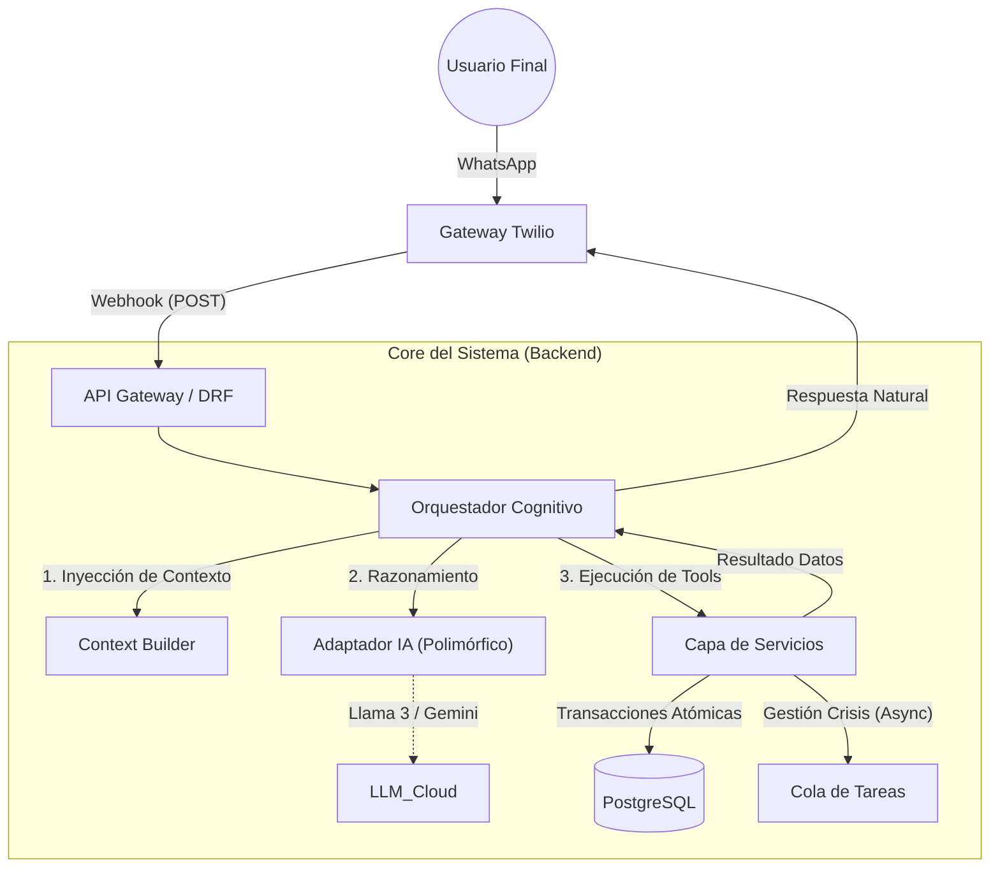

<div align="center">
  <a href="#">
    
  </a>

  <h1 style="margin-top: 20px;">AgendIA / Cyborg SaaS</h1>
  
  <p style="font-size: 1.2em;">
    <strong>El Primer Sistema Operativo Autónomo para Negocios de Servicios.</strong><br>
    Gestión de citas, clientes y crisis vía WhatsApp con Inteligencia Artificial Generativa.
  </p>

  <p>
    
    
    
    
    
  </p>

  <p>
    <a href="ARCHITECTURE.md"><strong>📐 Ver Arquitectura Completa</strong></a> •
    <a href="AI_WORKFLOW.md"><strong>🧠 Ver Protocolos de IA</strong></a> •
    <a href="ROADMAP.md"><strong>🗺️ Ver Roadmap Detallado</strong></a>
  </p>
</div>

---

## 🚀 La Propuesta de Valor

**AgendIA** (Codenamed _Cyborg_) nace para solucionar el problema de la "recepción desatendida". La mayoría de las PYMES de servicios pierden el 30% de sus oportunidades de venta por no poder atender el teléfono o WhatsApp al instante.

A diferencia de los chatbots tradicionales (rígidos y frustrantes), **AgendIA es un agente cognitivo**. Entiende el lenguaje natural, el contexto temporal ("mañana", "la semana que viene") y las reglas de negocio, actuando como un recepcionista humano experto disponible 24/7.

---

## 🏗️ Arquitectura del Sistema

El sistema sigue una variación de **Arquitectura Hexagonal (Ports & Adapters)** para desacoplar la lógica de negocio de los proveedores externos. Esto permite cambiar el "cerebro" (de Groq a Gemini) o el canal de mensajería sin tocar el núcleo.



---

## 🧠 El Cerebro: Flujo de Inteligencia Artificial

Esta es la pieza central del proyecto. La IA no funciona como un chatbot de texto, sino como un **operador de base de datos** que usa lenguaje natural.

### 1. El Ciclo Cognitivo (The Cognitive Loop)

Cada mensaje pasa por un proceso de 4 fases antes de responder:

1.  **Enriquecimiento:** Antes de enviar el mensaje a la IA, el sistema inyecta datos invisibles: _Fecha actual, Horarios del negocio, Lista de Servicios y Estado del Cliente_.
2.  **Razonamiento (Reasoning):** La IA analiza la intención. ¿Quiere reservar? ¿Quiere cancelar? ¿Solo está saludando?
3.  **Uso de Herramientas (Tool Calling):** Si el usuario pide una cita, la IA **NO responde texto**. En su lugar, emite un comando JSON:
    ```json
    {
      "tool": "check_availability",
      "args": { "date": "2025-12-20", "service_id": 1 }
    }
    ```
4.  **Ejecución Segura (Zero-Trust):** El Backend intercepta ese JSON, consulta la base de datos real y devuelve los huecos libres. Solo entonces la IA genera la respuesta final al usuario.

### 2. Protocolos de Seguridad

- **Anti-Alucinación:** La IA tiene prohibido inventar horas. Si la base de datos dice "Lleno", la IA debe decir "Lleno".
- **Confirmación Silenciosa:** Cuando se confirma una reserva, el mensaje final no lo redacta la IA, lo genera el sistema basándose en el registro guardado en PostgreSQL. Esto garantiza 100% de fiabilidad en los datos mostrados.

---

## 📸 Galería del Sistema

<table border="0">
  <tr>
    <td width="50%" valign="top">
      <h3 align="center">Depuración de IA (Logs)</h3>
      <p align="center">Visualización técnica de los "pensamientos" de la IA. Los bloques verdes muestran las herramientas ejecutadas (check_availability, book_appointment) en tiempo real.</p>
      
    </td>
    <td width="50%" valign="top">
      <h3 align="center">Calendario Interactivo</h3>
      <p align="center">Gestión visual con <strong>Drag & Drop</strong>. Al mover una cita, el sistema detecta el cambio y envía una notificación automática de WhatsApp al cliente.</p>
      
    </td>
  </tr>
  <tr>
    <td width="50%" valign="top">
      <h3 align="center">Dashboard de Negocio</h3>
      <p align="center">Control financiero y operativo. Métricas en tiempo real de ocupación, ingresos estimados y captación de nuevos leads.</p>
      
    </td>
    <td width="50%" valign="top">
      <h3 align="center">Agnosticismo Tecnológico</h3>
      <p align="center">Configuración en caliente del proveedor de IA (Groq, Gemini, Ollama) y la personalidad del bot sin desplegar código.</p>
      
    </td>
  </tr>
</table>

---

## 🔥 Funcionalidades Clave

### 🤖 Recepción Autónoma

- **Conversación Natural:** Maneja cambios de contexto ("Mejor el martes no, espera, ¿qué precio tenía el tinte?").
- **Gestión de Ciclo de Vida:** Reservas, Reagendamientos y Cancelaciones.
- **Cold Start:** Detecta clientes nuevos y solicita su nombre proactivamente.

### 🚨 Gestión de Crisis (Unique Selling Point)

El sistema incluye un módulo de **Recuperación de Desastres**:

1.  El administrador marca una "Baja Médica" para un empleado en el panel.
2.  El sistema calcula inmediatamente todas las citas futuras en conflicto.
3.  Se dispara una tarea en segundo plano (Celery) que usa la IA para contactar a cada cliente afectado, explicar la situación y negociar una nueva hora.

---

## 🗺️ Roadmap de Desarrollo

> **Estado Actual:** `v1.0-beta` (MVP Estable)

- [x] **Core:** Motor de IA, Webhooks WhatsApp, Calendario y Logs.
- [x] **Infraestructura:** Colas asíncronas (Redis/Celery) y Base de Datos (PostgreSQL).
- [ ] **Fase 2 (CRM):** Sistema de Puntos, Marketing Automatizado y Recuperación de Clientes inactivos.
- [ ] **Fase 3 (SaaS):** Multi-tenancy real, Pasarela de Pagos (Stripe) y App Móvil.

---

<div align="center">
  <h3>🔒 Nota de Privacidad</h3>
  <p>
    Este repositorio contiene exclusivamente documentación técnica y capturas de pantalla.<br>
    El código fuente es privado y propiedad intelectual de sus desarrolladores.
  </p>
  <p>Copyright © 2025 AgendIA / Cyborg SaaS</p>
</div>
