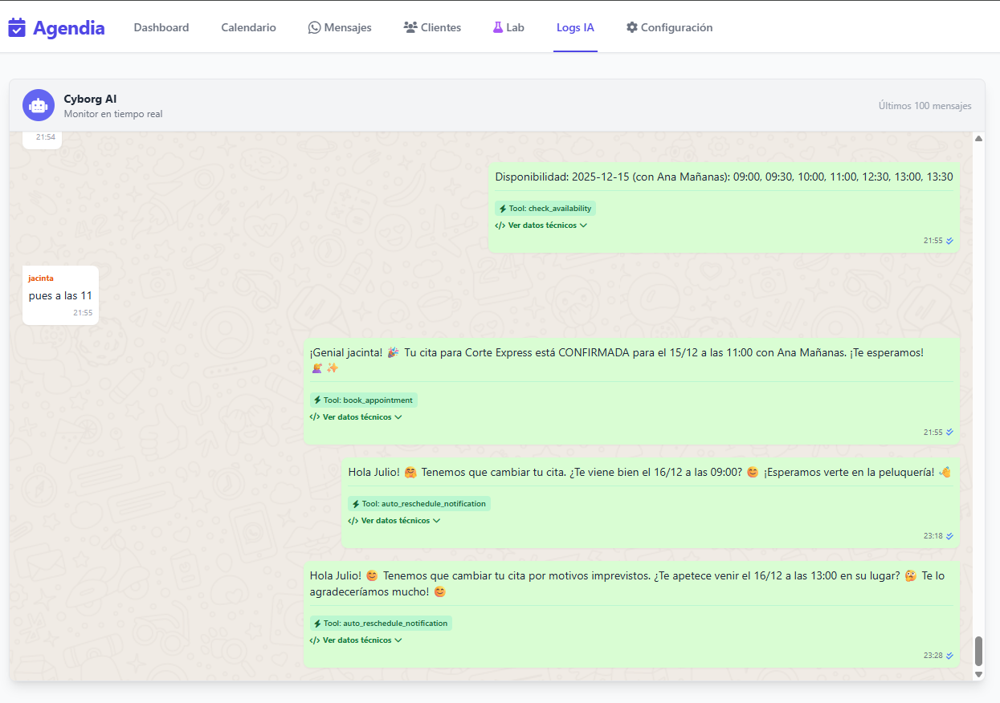
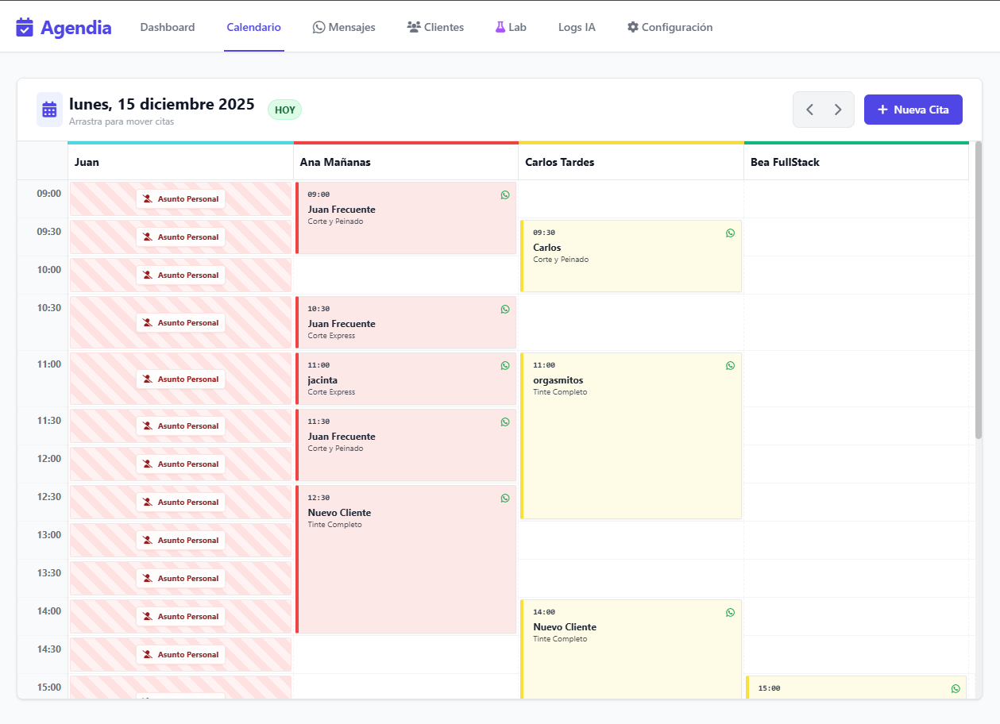
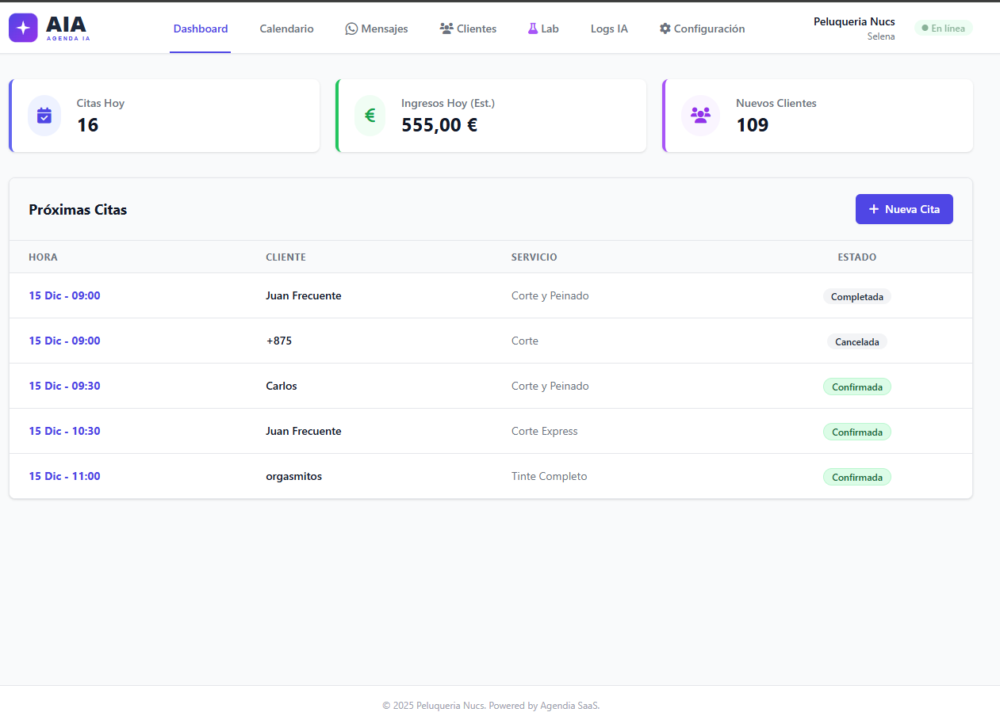
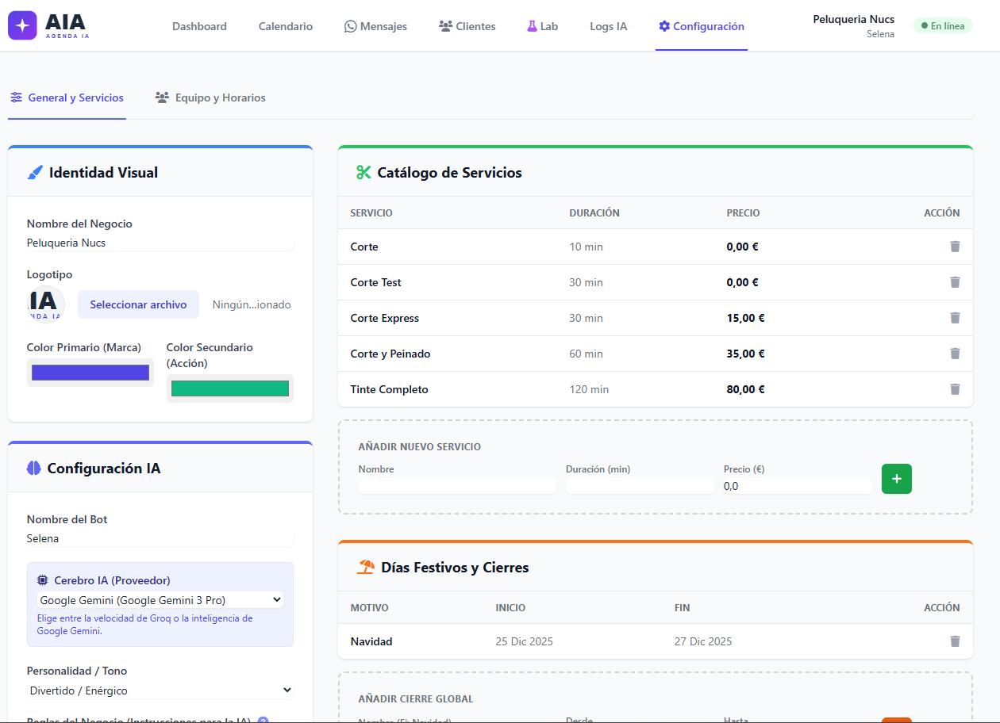

  

  <h1 style="margin-top: 20px;">AgendIA / Cyborg SaaS</h1>
  
  

    <strong>El Primer Sistema Operativo Autónomo para Negocios de Servicios.</strong> 
    Gestión de citas, clientes y crisis vía WhatsApp con Inteligencia Artificial Generativa.
  

  

    
    
    
    
  

---

## 🚀 La Propuesta de Valor

**AgendIA** (Codenamed _Cyborg_) nace para solucionar el problema de la "recepción desatendida". La mayoría de las PYMES de servicios (clínicas, barberías, talleres) pierden el 30% de sus oportunidades de venta por no poder atender el teléfono o WhatsApp al instante.

A diferencia de los chatbots tradicionales (rígidos y frustrantes), **AgendIA es un agente cognitivo**. Entiende el lenguaje natural, el contexto temporal ("mañana", "la semana que viene") y las reglas de negocio, actuando como un recepcionista humano experto disponible 24/7.

---

## 🔥 Funcionalidades Core (El Producto)

### 1. Recepción Autónoma vía WhatsApp

El sistema vive donde están los clientes: en WhatsApp. No requiere instalar apps ni recordar contraseñas.

- **Conversación Natural:** El cliente habla como quiere. _"Hola, ¿tienes hueco para un corte el viernes por la tarde?"_.
- **Gestión del Calendario:** La IA consulta la disponibilidad en tiempo real y ofrece huecos libres.
- **Ciclo de Vida Completo:** Gestiona reservas, cambios y cancelaciones sin intervención humana.
- **Cold Start Inteligente:** Si es un cliente nuevo, la IA sabe que debe preguntar su nombre antes de confirmar nada para crear la ficha en el CRM.

### 2. Panel de Control "Mission Control"

Una interfaz web reactiva (Django + TailwindCSS) para que el dueño del negocio supervise todo.

- **Calendario Drag & Drop:** Mover una cita con el ratón dispara automáticamente una notificación de WhatsApp al cliente informando del cambio.
- **Gestión de Equipo:** Configuración de horarios complejos, turnos partidos y especialidades por empleado.
- **Dashboard de KPIs:** Métricas en tiempo real de ocupación, ingresos estimados y captación de clientes.

### 3. Protocolo de Gestión de Crisis (Unique Selling Point)

Esta es la funcionalidad que diferencia a AgendIA de cualquier agenda digital. ¿Qué pasa si un empleado se pone enfermo un viernes por la mañana?

- **Detección:** El administrador marca una "Ausencia/Baja" en el sistema.
- **Cálculo:** El backend identifica inmediatamente todas las citas que entran en conflicto con esa ausencia.
- **Acción:** La IA genera mensajes personalizados disculpándose y contacta a cada cliente afectado para ofrecerle huecos alternativos con otros compañeros o en otros días.

### 4. Auditoría y Transparencia

- **Logs de IA (Caja Negra):** Cada decisión tomada por la IA se registra. Podemos ver qué "pensó", qué herramienta ejecutó (`check_availability`) y qué respuesta generó.
- **Human Takeover:** En cualquier momento, un humano puede intervenir en el chat desde el panel de control y la IA se pausa.

---

## 📸 Galería del Sistema

<table border="0">
  <tr>
    <td width="50%" valign="top">
      <h3 align="center">El Cerebro (Logs de IA)</h3>
      
Visualización de cómo la IA "piensa" y ejecuta herramientas (bloques verdes) antes de responder.

      
    </td>
    <td width="50%" valign="top">
      <h3 align="center">El Calendario</h3>
      
Gestión visual. Soporta múltiples columnas, bloqueos visuales y estados de cita por colores.

      
    </td>
  </tr>
  <tr>
    <td width="50%" valign="top">
      <h3 align="center">Dashboard de Negocio</h3>
      
Control financiero y operativo en un vistazo.

      
    </td>
    <td width="50%" valign="top">
      <h3 align="center">Configuración Agnóstica</h3>
      
Selector de proveedor de IA en caliente (Groq, Gemini, Local).

      
    </td>
  </tr>
</table>

---

## 📚 Ingeniería Bajo el Capó (Deep Dives)

Hemos documentado la arquitectura interna para facilitar la auditoría técnica. Te invitamos a explorar cómo hemos construido este sistema modular:

### 1. [📐 Arquitectura del Sistema](ARCHITECTURE.md)

Descubre cómo aplicamos **Arquitectura Hexagonal (Ports & Adapters)** para desacoplar el núcleo de negocio de los proveedores externos.

- _Diagrama de flujo de datos (Mermaid)._
- _Gestión de colas asíncronas (Celery/Redis)._
- _Protocolos de seguridad Zero-Trust._

### 2. [🧠 El Cerebro: Workflow de IA](AI_WORKFLOW.md)

Una inmersión profunda en nuestro **Orquestador Cognitivo**.

- _Cómo funciona el "Tool Calling" (Function Calling)._
- _Inyección dinámica de contexto temporal._
- _Mecanismos anti-alucinación._

### 3. [🗺️ Roadmap y Futuro](ROADMAP.md)

El estado actual del proyecto y la visión a largo plazo.

- _Estado: MVP Estable (v1.0)._
- _Próximos pasos: CRM de Fidelización, Puntos y Multi-Tenancy._

---

  <h3>🔒 Nota de Privacidad</h3>
  

    Este repositorio contiene exclusivamente documentación técnica y capturas de pantalla. 
    El código fuente es privado y propiedad intelectual de sus desarrolladores.
  

  

    ¿Interesado en el proyecto? <a href="mailto:contacto@agendia.app">Contáctanos</a>
  

   
  
Copyright © 2025 AgendIA / Cyborg SaaS

